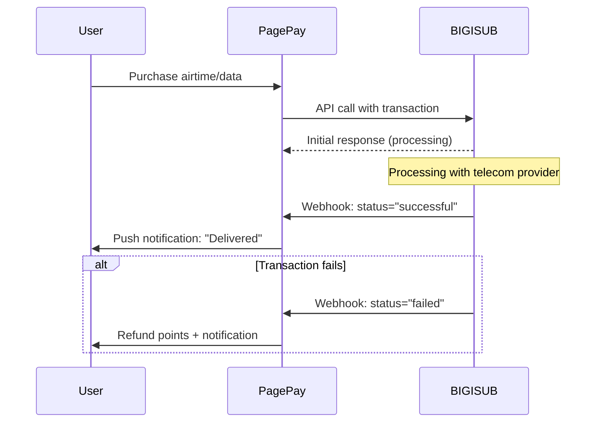

# BIGISUB Webhook Implementation Summary

## Based on BIGISUB API v2.0.0 Documentation

### ✅ What We Implemented

Our webhook endpoint at `POST /webhooks/bigisub/verify` now correctly handles BIGISUB's documented transaction status values:

#### **Status Values Supported:**
- **`"successful"`** → Mark as delivered, confirm transaction success
- **`"processing"/"pending"/"submitted"`** → Update as pending, continue waiting
- **`"failed"`** → Auto-refund user points, mark as failed

#### **Webhook Payload Format:**
Based on BIGISUB API patterns, we expect:
```json
{
  "transaction_id": "167630",
  "reference": "our_transaction_reference", 
  "status": "successful",
  "network": "MTN",
  "amount": "100.0",
  "mobile_number": "08012345678",
  "create_date": "2021-08-28T21:02:54.311846",
  "message": "Transaction completed successfully"
}
```

#### **Transaction Matching Logic:**
1. First try `reference` field (our transaction reference)
2. Then try `external_reference` field (alternative)  
3. Finally try `transaction_id` matched to our `external_ref` field

#### **Security:**
- HMAC-SHA256 signature verification using `BIGISUB_API_KEY`
- Invalid signatures return 401 Unauthorized
- Malformed JSON returns 400 Bad Request

#### **User Notifications:**
- **Success**: "Airtime/Data Delivered" push notification
- **Failure**: "Purchase Refunded" with points amount
- **Processing**: No notification (status update only)

### 🔧 BIGISUB Dashboard Configuration

To enable webhooks, configure in your BIGISUB dashboard:

1. **Webhook URL**: `https://yourdomain.com/api/v1/webhooks/bigisub/verify`
2. **Events**: Transaction status updates (successful, failed, processing)
3. **Signature**: Enable HMAC-SHA256 signing with your API key

### 📊 Transaction Status Reference

According to BIGISUB API v2.0.0 documentation:

| Status | Meaning | Our Action |
|--------|---------|------------|
| `successful` | Delivered to recipient | Mark delivered, confirm success |
| `processing` | Pending with provider | Update as pending, wait |
| `failed` | Failed, wallet auto-refunded | Refund user points |
| `pending` | Queued for processing | Update as pending, wait |
| `submitted` | Same as processing | Update as pending, wait |

### 🧪 Testing Webhook

**Test endpoint**: `GET /webhooks/bigisub/test`  
Returns: `{"success": true, "message": "BIGISUB webhook endpoint is reachable"}`

Use this URL to verify webhook connectivity from BIGISUB dashboard.

### 🚀 Deployment Checklist

1. **Environment Variable**: Set `BIGISUB_API_KEY` in `.env`
2. **Webhook Router**: Already included in `main.py`
3. **Database Fields**: Delivery tracking fields added to `BillTransaction`
4. **Register URL**: Configure webhook URL in BIGISUB dashboard
5. **Test Connection**: Use test endpoint to verify reachability

### 📋 Transaction Flow



### ✅ Complete Implementation

All 6 backend features are now complete:
1. ✅ PDF Receipt Generation
2. ✅ VTU Dispute/Refund System  
3. ✅ Purchase Rate Limiting
4. ✅ Bulk Airtime Purchases
5. ✅ Scheduled Purchases (APScheduler)
6. ✅ **Balance Verification Webhook (BIGISUB-compliant)**

The webhook implementation follows BIGISUB's documented API v2.0.0 status values and provides robust transaction verification for the Bills & Earn feature.