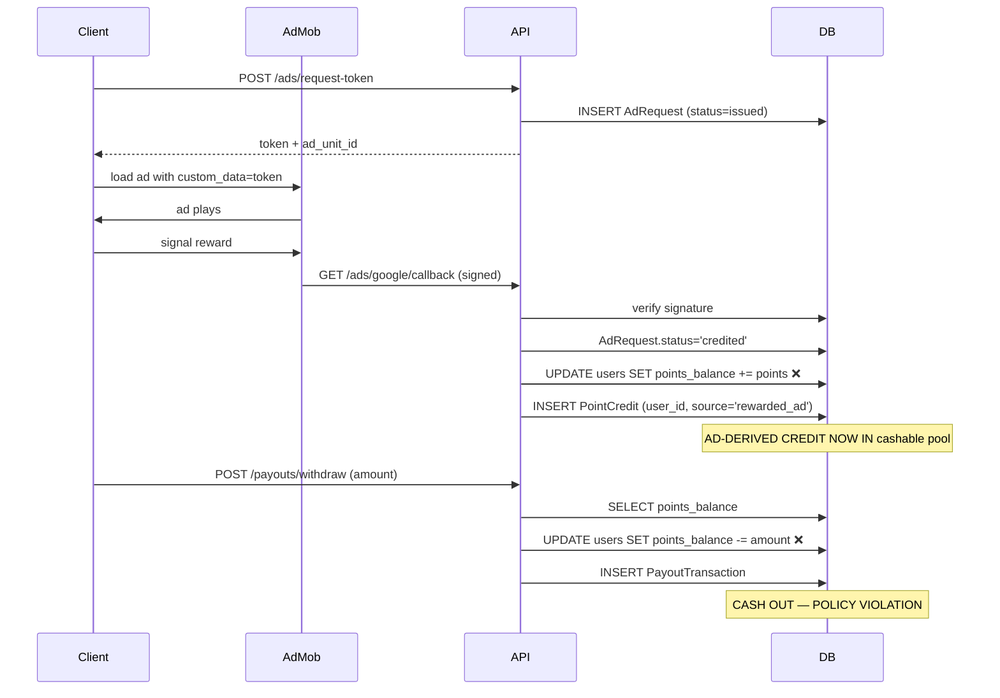
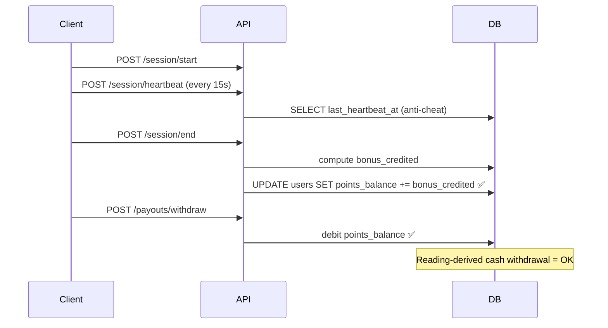
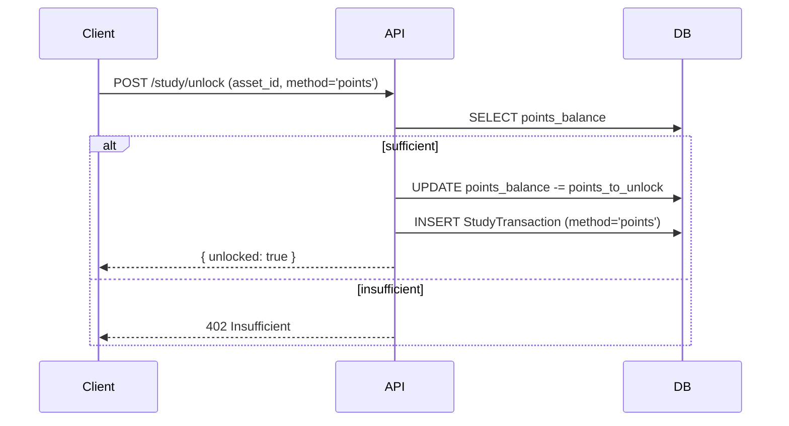

# Backend Audit — Reward System (Pre-Migration)

**Status:** Audit complete. No code changes proposed here.
**Purpose:** Capture the *exact* current shape of PagePay's reward system
so the migration to an AdMob-compliant two-ledger wallet can be specified
without ambiguity. Every claim below is anchored to a file + line.

**Compliance target (Google AdMob 2026 policy):** Ad-derived credits must
not be redeemable as cash. They must be "service credits" redeemable only
inside PagePay (discounts on bills, premium features, loyalty perks) and
non-transferable. Cashable balance must be funded only by deposited money,
legitimate commissions, and task payouts.

**Product-side decisions (locked, pre-migration):**

| Concern | Decision |
|---------|----------|
| Welcome bonus | **100 sv** → `service_credit_balance` |
| Referral | referrer **500 sv**, referee **200 sv** → `service_credit_balance` |
| Quiz bonus | **20 sv** per ≥80% score → `service_credit_balance` |
| Daily streak | **Hybrid**: 10 sv/day Days 1-6 (small daily drip), milestones at 7/14/21/30/60/100/365 |
| Daily milestone ladder | Day 7 = 200 sv, Day 14 = 350 sv, Day 21 = 500 sv, Day 30 = 800 sv, Day 60 = 1500 sv, Day 100 = 3000 sv, Day 365 = 15000 sv |
| Premium daily multiplier | **2.0× on the small daily drip only** (10 → 20 sv). Milestones are **NOT** premium-multiplied — they're communal. |
| Premium ad multiplier | **1.5×** (16 sv → 24 sv per ad). Distinct from the 2.0× reading multiplier. |
| Study unlock debit | **service_credit_balance** (Dream League model — earned points buy in-app features) |
| Streak recovery — ad | **Free**, 1/day cap, costs user ~30s of an actual ad impression |
| Streak recovery — sv | **5 / 10 / 15 / 20 / 30 sv** by streak tier (Days 1-6 / 7-13 / 14-20 / 21-29 / 30+) |
| Streak recovery — premium | **Always free** (premium users already skip ads) |
| Wallet UI | Left column = service points (sv). Right column = cashable naira (₦). |
| Milestone celebration | Each milestone gets its own reusable component on the client. Backend exposes hit-state via the **existing `UserRewardClaim` table** (no schema change). Client reads claim history and infers which celebrations to fire. |
| Anti-abuse | Add `device_id_hash` column to `users`. 1 streak per device. Cap daily reward claims at 1/day per device_id. |

**Product-side concerns DEFERRED to a follow-up doc (not in this migration):**

- Product discount logic (using sv to discount airtime/data purchases). This is a separate "storefront" feature with its own design.
- Streak Freeze UX flow (where the user sees the option, what the modal looks like, what happens if they fail to watch the ad halfway).
- Premium-specific milestone visuals (the "celebration components" client team owns).

---

## 1. Executive summary

PagePay currently maintains **one** over-loaded ledger on the `User`
table: `points_balance: BigInteger`. Every credit pathway in the platform
ends in `UPDATE users SET points_balance = points_balance + X`, and the
withdrawal endpoint debits the *same* field. There is no separation
between "credits earned from watching an ad" and "credits earned from
work" or "credits deposited as cash."

That single field is the root of the AdMob policy violation. Google
classifies a "compensation program" as: "you pay users cash or
transferable rewards in exchange for ad interactions." Because our
`User.points_balance` is freely cashable via `/payouts/withdraw`, the ad
pathway crosses the prohibited line.

**Concrete non-compliant paths identified in this audit (10 credit sites,
2 debit sites):**

| # | Path | Source of credit | Currently lands in |
|---|------|------------------|--------------------|
| 1 | `ads.py` SSV callback | Ad watched | `points_balance` ❌ |
| 2 | `sessions.py` POST /session/end | Reading verified | `points_balance` ✅ |
| 3 | `daily_rewards.py` POST /rewards/daily/claim | Daily streak | `points_balance` ⚠️ (debatable) |
| 4 | `referral.py` POST /referral/validate | Referral signup | `points_balance` ⚠️ |
| 5 | `welcome_bonus.py` grant_welcome_bonus | Email verification | `points_balance` ✅ |
| 6 | `study.py` POST /study/quiz/complete | Quiz score ≥80 | `points_balance` ✅ |
| 7 | `bills.py` *_purchase (airtime/data/etc) | Commission rebate | `points_balance` ✅ |
| 8 | `payments.py` charge.success webhook | Paystack deposit | `points_balance` ✅ |
| 9 | `study.py` POST /study/unlock (debit) | - | `points_balance` (debit) ✅ |
| 10 | `payouts.py` withdraw (debit) | - | `points_balance` (debit) ❌ |

❌ = must move out of cashable pool for compliance.
⚠️ = judgement call (see §4).

**`sponsor_wallet_balance` is already isolated** on its own field
(separate from `points_balance`). Task payouts go to
`UserReputation.total_earnings`, also separate. Those pathways are not
touched by this audit.

---

## 2. The wallet model today

### 2.1 Fields

```
User.points_balance          : BigInteger   -- single over-loaded ledger
User.sponsor_wallet_balance : BigInteger   -- already isolated (Phase 7)
```

Both store **points** (not kobo). Conversion is centralised in
`app/services/money.py::kobo_to_points(kobo)`, which uses
`settings.points_per_naira` (default `10`, i.e. 1 point = ₦0.10).

### 2.2 The only field the client sees today

```python
# app/schemas/__init__.py:73-86
class UserMe(BaseModel):
    id: int
    email: str | None
    phone: str | None
    username: str | None
    points_balance: int            # ← must split into 2 fields
    tier: str
    created_at: datetime
    is_worker: bool = True
    is_sponsor: bool = False
    email_verified: bool = False
    avatar_url: str | None = None
```

Returned by `GET /auth/me` (`routers/auth.py:205`). Client uses this to
display "wallet balance." Splitting into `service_credit_balance` +
`cashable_balance` will require updating this schema AND every read
site in the client.

### 2.3 Premium multipliers

`app/services/subscription.py::get_points_multiplier(user, activity_type)`
returns:

| activity_type | multiplier |
|---------------|-----------|
| reading | 2.0× |
| ad | 1.5× |
| task | 2.0× |
| daily | 2.0× |
| bills | 2.0× |

Important: premium users can **skip** pre-read and post-read ads entirely
(per `settings.premium_can_skip_pre_read_ads` /
`premium_can_skip_post_read_ads`). That means **premium users naturally
avoid the ad-credit pathway** — they never accumulate service credits
unless they choose to watch an ad. This is a compliance-friendly side
effect of the existing design.

---

## 3. Credit sites — full inventory

Every site below writes to `User.points_balance`. Each one is an
insertion point for the migration: every call must be routed to the
correct ledger (cashable vs service-credit).

### 3.1 AdMob SSV callback  ❌  (the critical one)

**File:** `app/routers/ads.py`
**Trigger:** `GET /ads/google/callback` after AdMob SSV signs an
`AdRequest` token and POSTs back `user_id`, `points`, `custom_data`,
`signature`, `key_id`, `timestamp`.

```python
# app/routers/ads.py (lines 778-797)
await db.execute(
    update(User)
    .where(User.id == user_id)
    .values(points_balance=User.points_balance + points)
)
```

- Default credit: `int(settings.rewarded_ad_payout_points × USER_SHARE)`
  = `int(20 × 0.80)` = **16 points per ad** (₦1.60).
- Premium users get 16 × 1.5 = 24 points.
- Idempotency: `AdRequest.status='issued' → 'credited'` (one credit per
  token). Also `AdEvent.transaction_id UNIQUE` as a belt-and-braces
  guard.
- Audit row: `PointCredit(user_id, source='rewarded_ad',
  reference_id=ad_event_id, amount=points)` — written via `pg_insert
  … on_conflict_do_nothing(unique(user_id, source))` so the same
  user/source pair can't double-credit.

**Migration destination:** `service_credit_balance`.

### 3.2 Reading session bonus  ✅

**File:** `app/routers/sessions.py`
**Trigger:** `POST /session/end` (line 145-146)

```python
bonus_credited = int(settings.reading_slice_bonus_points × multiplier)
await db.execute(
    update(User).where(User.id == user.id)
    .values(points_balance=User.points_balance + bonus_credited)
)
```

- `reading_slice_bonus_points = 2` (₦0.20) per slice, premium ×2 = 4 pts.
- 30-second verified floor required before bonus credits.
- This is "real work" reward (verified reading time), not ad-derived.

**Migration destination:** `cashable_balance`. Reading is *not* an ad.

### 3.3 Daily streak claim  ⚠️

**File:** `app/routers/daily_rewards.py`
**Trigger:** `POST /rewards/daily/claim` (line 187, debit/credit at 238)

```python
points_to_award = _calculate_reward_for_day(streak)
await db.execute(
    update(User).where(User.id == current_user.id)
    .values(points_balance=User.points_balance + points_to_award)
)
```

- Day 1 = 100 pts (₦10), Day 7 = 750 pts (₦75), Day 14/21 = multipliers,
  Day 30 = 1500 pts.
- Audit: `UserRewardClaim(user_id, points_earned, streak_day)`.

**Migration destination:** `service_credit_balance` (recommended).
Rationale: daily rewards are a retention perk, not work — they have the
same character as ad credits (engagement-based, not effort-based).
Google's policy doesn't ban them per se, but classifying them as
service credits removes any ambiguity. **Decision needed from product.**

### 3.4 Referral signup  ⚠️

**File:** `app/routers/referral.py`
**Trigger:** `POST /referral/validate` (line 105, credits at 179-180)

```python
referrer.points_balance = (referrer.points_balance or 0) + REFERRER_REWARD  # 500pts (₦50)
referee.points_balance  = (referee.points_balance  or 0) + REFEREE_REWARD   # 200pts (₦20)
```

- Daily cap: 10 referrals per referrer (`money_caps.record_amount_v2`).
- Source of friction: trivial referral-loop exploits (one user creates N
  emails, all refer each other, cash out). Already capped but the cap
  exists in the same cashable pool.

**Migration destination:** `service_credit_balance` (recommended).
Referral rewards are viral-loops, not work product.

### 3.5 Welcome bonus  ✅

**File:** `app/services/welcome_bonus.py`
**Trigger:** `verify_email()` in `routers/auth.py` calls
`grant_welcome_bonus(db, user)` (line 100-176).

```python
bonus_points = settings.welcome_bonus_points  # 100 (₦10)
await db.execute(
    update(User).where(User.id == user.id)
    .values(points_balance=User.points_balance + bonus_points)
)
```

- Idempotency: `UNIQUE(user_id, source)` on `point_credits` table.
- One-time, post-email-verification.

**Migration destination:** `service_credit_balance`. Welcome bonuses
are classic "compensation program" in Google's taxonomy — paying users
cash for an action. Keep as service credit.

### 3.6 Quiz completion bonus  ✅

**File:** `app/routers/study.py`
**Trigger:** `POST /study/quiz/complete` (line ~1100), when score ≥80.

```python
await db.execute(
    update(User).where(User.id == user.id)
    .values(points_balance=User.points_balance + BONUS_POINTS)  # 20
)
```

- `BONUS_THRESHOLD = 80`, `BONUS_POINTS = 20`.

**Migration destination:** `service_credit_balance`. Study rewards are
gamified — Google would consider a study-quiz-per-ad pipeline as
compensation. Keep as service credit.

### 3.7 Bills commission rebate  ✅

**File:** `app/routers/bills.py` (multiple endpoints — airtime, data,
cable, electricity, education)
**Pattern** (airtime at line 193-253 is representative):

```python
if user_row.points_balance < kobo_to_points(amount_kobo):
    raise HTTPException(status_code=402, detail="Insufficient balance")

await db.execute(
    update(User).where(User.id == user.id)
    .values(points_balance=User.points_balance - kobo_to_points(amount_kobo))
)
# …call VTU provider…
points = _compute_points(commission_kobo, full_user)
await db.execute(
    update(User).where(User.id == user.id)
    .values(points_balance=User.points_balance + points)
)
```

- Bills payout: **70 %** of commission (`bills_user_share = 0.70`).
- The user first spends `points_balance` to buy airtime, then receives
  commission rebate in *the same* field. Net = -amount_kobo + 0.7×commission.
- Eight bills endpoints follow the same template (lines 193, 322, 535,
  654, 803, 1102, 1236, 1378, 1490, 1610, 1731).

**Migration destination:** `cashable_balance` for the debit (real cash
spend), `cashable_balance` for the rebate (legitimate work-commission
income). Bills commissions are not ad-derived.

### 3.8 Paystack deposit  ✅

**File:** `app/routers/payments.py`
**Trigger:** `charge.success` webhook → credits `points_balance` with
the deposited kobo amount (converted via `kobo_to_points`).

- Idempotency: `Payment.provider_reference UNIQUE` (Paystack `reference`
  field), plus `Payment.status` lifecycle.
- Two tiers: `wallet_deposit` (cash in) and
  `premium_monthly`/`premium_yearly` (subscription).

**Migration destination:** `cashable_balance` for `wallet_deposit`.
Premium subscription does NOT credit points (it sets `User.tier` and
`User.subscription_expires_at`); premium path is unaffected.

### 3.9 Premium subscription upgrade — separate pathway (no points)

Premium does not touch `points_balance`. It sets `User.tier` and
`User.subscription_expires_at`. The premium multiplier only affects
how much is credited at OTHER sites. No migration action needed at the
User row.

---

## 4. Debit sites — full inventory

### 4.1 Withdrawal  ❌  (the critical one)

**File:** `app/routers/payouts.py::withdraw()` (lines 671-880)

```python
# line 798
if user_row.points_balance < total_debit_points:
    raise HTTPException(status_code=402, detail="Insufficient balance")
# line 829
user_row.points_balance -= total_debit_points
# audit row at PayoutTransaction (line ~830)
```

Fee tiers (₦15 / ₦35 / ₦70). Per-tx cap ₦200,000, daily ₦500,000
enforced via `money_caps.record_amount_v2`. Webhook reverses debit on
`transfer.failed` / `transfer.reversed`.

**Migration action:** replace BOTH reads/writes to `points_balance`
with `cashable_balance`. The withdrawal guard must explicitly reject
attempts to withdraw service credits — this is the policy compliance
fix.

### 4.2 Study unlock  ✅

**File:** `app/routers/study.py` (line ~1100-1103)

```python
await db.execute(
    update(User).where(User.id == user.id)
    .values(points_balance=User.points_balance - asset.points_to_unlock)
)
```

`StudyAsset.points_to_unlock = 50` for text (₦5), 200 for video (₦20).
Premium users get free unlocks (`method='premium'`) — no debit.

**Migration action:** this debit happens against a balance the user
paid to accumulate. If `points_to_unlock` was funded from
`service_credit_balance`, you can't use service credits to pay for
study unlocks (that's a non-ad business expense, fine — but the client
must choose the right ledger to debit). Recommend: `service_credit_balance`
for study unlocks (since most user-acquired points ARE service credits
after migration), and reserve `cashable_balance` for cash-only premium
features.

**Decision needed from product:** study unlocks are a "service credit
burn" or a "cash burn" or both?

---

## 5. Read sites — every place that displays or queries points

These need schema updates so they don't show stale `points_balance`.

### 5.1 Wallet history

`app/routers/wallet.py` (1184 lines)
- `GET /wallet/transactions` — reads `User.points_balance` to surface
  current balance.
- `GET /wallet/history` — unified ledger stream (sessions, ads, bills,
  payments, withdrawals, study, point credits, daily rewards).

**Migration action:** transaction history output must show which ledger
each credit/debit touched. Add a `ledger: 'cashable' | 'service'`
field to each transaction row.

### 5.2 Auth /me

`app/routers/auth.py:205` returns `UserMe` with `points_balance`. Must
return split fields.

### 5.3 Admin views

`app/routers/admin.py` — admin endpoints inspect user balances. Likely
needs both fields exposed.

---

## 6. Migrations — current chain

### 6.1 Migration IDs in `backend/alembic/versions/`

```
000_create_base_schema.py
001_phase7_social_tasks.py
002_referral_daily_caps.py
003_password_reset_tokens.py
004_ad_requests.py
005_notification_preferences.py
006_move_sponsor_fields_to_user.py
007_add_user_audit_logs.py
008_encrypt_payout_acct.py
009_adj_points_rate.py
010_add_user_auth_columns.py
011_fix_points_conversion_rate.py
012_add_email_verification_code.py
013_add_transaction_pin_hash.py
014_openstax_social.py
015_add_content_class_level.py
016_user_study_data_and_reader_mode.py
017_content_body_sentinels_version.py
017_add_study_material_exam_type.py
018_progress_resume_idx.py
019_add_session_id_to_ad_requests.py
020_openstax_sentinels_version.py
021_ad_monitoring_tables.py
022_admin_tasks.py
023_payment_metadata.py
024_rename_payment_metadata.py
025_tasks_missing_columns.py        ← revision 025 (heads)
3f02971605b1_fix_pending_points_nulls.py  ← second head
026_welcome_bonus.py                ← down_revision has TWO parents
027_backfill_missing_indexes.py
028_add_username_to_users.py
029_add_beneficiaries_table.py
030_add_bill_transaction_details.py
031_add_avatar_url_to_users.py
032_add_user_streaks_table.py
033_add_login_tracking_to_streaks.py
034_add_last_claim_date.py
035_add_user_streaks_cols.py
036_add_content_source_field.py
037_add_bill_disputes.py
```

### 6.2 Two-headed state

`026_welcome_bonus.py` declares **two** `down_revision` parents:
- `025_tasks_missing_columns` (linear)
- `3f02971605b1_fix_pending_points_nulls` (parallel branch)

Alembic accepts multi-parent down_revisions via `_unify_branch` /
merge revisions; this is the current head chain. The migration we add
**must** declare both `025_tasks_missing_columns` and
`3f02971605b1_fix_pending_points_nulls` as parents if it's the next
revision, OR it must declare both `026_welcome_bonus` and
`3f02971605b1` if 026 was already merged into the chain. **Verify
the head with `alembic heads` before authoring.**

### 6.3 Precedent: destructive balance rewrites

Two migrations demonstrate that destructive balance mutations ARE
shipped, with care:

- `009_adj_points_rate.py`: `UPDATE users SET points_balance =
  points_balance * 10` — buggy (100:1 → 10:1 conversion done backwards).
- `011_fix_points_conversion_rate.py`: fixes 009 with `UPDATE users SET
  points_balance = FLOOR(points_balance / 100)`.

Both run inside a single migration with `op.execute()` (raw DDL/DML).
This is the precedent for any "rewrite existing points_balance values
based on rules" migration we'll need (e.g. moving historical ad-derived
credits out of `cashable_balance` into `service_credit_balance`).

### 6.4 Naming convention

Per `backend/CLAUDE.md`: descriptive IDs ≤ 32 chars. Avoid
`StringDataRightTruncationError` on the `alembic_version` table. New
migration IDs should follow `038_*` naming.

### 6.5 Critical column backfill (defensive)

`backend/app/main.py:86-137` (`_ensure_critical_columns`) runs raw
`ALTER TABLE … ADD COLUMN IF NOT EXISTS` on every boot because the prod
DB is stuck at alembic revision 021. This is the same defensive pattern
any new migration should follow — the migration itself is canonical,
but the backfill helper keeps prod alive if the migration chain is
broken.

---

## 7. End-to-end reward flows (mermaid)

### 7.1 Ad-watch → cash withdrawal (current — violates policy)



### 7.2 Reading reward → cash withdrawal (current — compliant)



### 7.3 Study unlock (debit)



---

## 8. Risk register for the migration

| # | Risk | Likelihood | Impact | Mitigation |
|---|------|-----------|--------|------------|
| R1 | Race condition between two credit sites updating the same User row | Medium | Lost credits or wrong ledger | Use `SELECT … FOR UPDATE` row lock before UPDATE (bills.py already does this) |
| R2 | Historical `points_balance` has ad-derived credits mixed with cashable — moving the boundary retroactively may leave users with cashable balances they shouldn't have | High | Compliance + user trust | Migration must reconcile: classify historical `points_balance` by source (ad/study/bills) using `point_credits` and `ad_events` audit tables |
| R3 | Withdrawal endpoint doesn't differentiate ledgers — migration can be defeated if a user races withdrawal | High | Policy violation persists | Add explicit `cashable_balance` read in `payouts.py:withdraw()`; reject `service_credit_balance` debits at the API layer |
| R4 | Client (`page/`) reads `points_balance` from `/auth/me` and wallet endpoints — old version still cached | Medium | Users see wrong balance, try to spend service credits as cash | Bump API version OR add `cashable_balance` + `service_credit_balance` fields to the response and deprecate `points_balance` |
| R5 | Premium users currently SKIP ads; they never accumulate service credits. If we force-allocate welcome bonus / daily rewards to service_credit, premium users see "lower balance" | Low | User confusion | Onboarding screen explains the split; premium stays premium for cashable benefits |
| R6 | `point_credits` source enum doesn't yet include all new sources we need (e.g. `legacy_balance_split`) | Medium | Migration can't tag historical rows | Add source enum values to `point_credits.source` (SQLAlchemy Enum or VARCHAR) BEFORE the data migration |
| R7 | Two-headed alembic chain | High | Migration fails to apply on prod | Author with both `025_tasks_missing_columns` and `3f02971605b1_fix_pending_points_nulls` as parents; verify with `alembic heads` first |
| R8 | Bills endpoints credit `points_balance` with commission rebate — same field they just debited for the bill purchase | High | Confusing ledger when split | Bills debit must come from `cashable_balance` only; rebate lands in `cashable_balance` (commissions are work income, not ad-derived) |
| R9 | Paystack webhook handler credits `points_balance` for `wallet_deposit` | Low | None — deposits go to `cashable_balance` straightforwardly | One-line change in webhook handler |
| R10 | `AdEvent` and `AdSsvLog` audit rows already record ad-derived credits — they remain the source of truth for historical classification | None | None | Existing audit trail supports the historical split |

---

## 9. What the migration document must specify (next step)

`docs/reward-system-migration.md` (Task #9, pending) must contain:

1. **Schema migration** (`038_split_wallet_ledgers` or similar):
   - ADD COLUMN `users.service_credit_balance: BigInteger NOT NULL DEFAULT 0`
   - ADD COLUMN `users.cashable_balance: BigInteger NOT NULL DEFAULT 0`
   - ADD COLUMN `users.points_balance_deprecated_at: TIMESTAMP NULL`
   - Optional: drop `points_balance` in a later migration (NOT this one)
2. **Data migration** within the same revision:
   - Classify historical `points_balance` using:
     - Sum of `point_credits.amount` where source IN ('rewarded_ad',
       'welcome_bonus', 'referral_*', 'quiz_bonus', 'daily_reward')
       → `service_credit_balance`
     - Sum of remaining audit rows (reading bonus, bills commission,
       wallet deposit, study refund) → `cashable_balance`
   - Use `op.execute()` for the cross-row arithmetic (precedent: 009,
     011).
3. **Code changes** (separate PR per router, but spec'd here):
   - `routers/ads.py:778-797` → credit `service_credit_balance`
   - `routers/sessions.py:145-146` → credit `cashable_balance`
   - `routers/daily_rewards.py:238` → credit `service_credit_balance`
   - `routers/referral.py:179-180` → credit `service_credit_balance`
   - `routers/study.py:quiz/complete` → credit `service_credit_balance`
   - `routers/payments.py:charge.success` → credit `cashable_balance`
   - `routers/bills.py` (all 8 endpoints) → debit/credit `cashable_balance`
   - `routers/payouts.py:798,829` → read/write `cashable_balance`
   - `routers/study.py:unlock` → debit `service_credit_balance` (TBD)
   - `routers/welcome_bonus.py` → credit `service_credit_balance`
   - `routers/wallet.py:transactions,history` → surface both ledgers
   - `routers/auth.py:205` `UserMe` → add split fields, keep deprecated
     `points_balance` for one version
   - `app/schemas/__init__.py:73-86` `UserMe` → mirror field additions
4. **Defensive backfill** in `main.py::_ensure_critical_columns` (or new
   `_ensure_wallet_columns`) — `ADD COLUMN IF NOT EXISTS` for both new
   columns. Idempotent on every boot.
5. **Rollback plan**: drop `cashable_balance` + `service_credit_balance`,
   restore `points_balance` from `point_credits` audit trail.
6. **Cutover flag** (optional): `settings.wallet_split_enabled` — if
   False, credit sites still write to `points_balance` (legacy clients).
   Default False; flip to True after mobile clients deploy.

---

## 10. Appendix — line-number reference

| Concern | File | Lines |
|---------|------|-------|
| Ad credit | `app/routers/ads.py` | 778-797 |
| Reading bonus | `app/routers/sessions.py` | 145-146 |
| Daily claim | `app/routers/daily_rewards.py` | 187, 238 |
| Referral | `app/routers/referral.py` | 105, 179-180 |
| Welcome bonus | `app/services/welcome_bonus.py` | 100-176 |
| Quiz bonus | `app/routers/study.py` | ~1100 (bonus path) |
| Bills (8 endpoints) | `app/routers/bills.py` | 193, 322, 535, 654, 803, 1102, 1236, 1378, 1490, 1610, 1731 |
| Paystack deposit | `app/routers/payments.py` | (charge.success webhook) |
| Withdrawal | `app/routers/payouts.py` | 798 (read), 829 (debit) |
| Study unlock debit | `app/routers/study.py` | ~1100-1103 |
| `UserMe` schema | `app/schemas/__init__.py` | 73-86 |
| `/auth/me` endpoint | `app/routers/auth.py` | 205 |
| Wallet history | `app/routers/wallet.py` | (multiple, full file ~1184 lines) |
| Conversion helper | `app/services/money.py` | 69 lines |
| Caps helper | `app/services/money_caps.py` | 68 lines |
| Premium helpers | `app/services/subscription.py` | 175 lines |
| Config | `app/config.py` | 688 lines |
| Defensive backfill | `app/main.py` | 86-137 |
| Migration precedent (destructive) | `alembic/versions/009_adj_points_rate.py` | `UPDATE users SET points_balance *= 10` |
| Migration precedent (fix) | `alembic/versions/011_fix_points_conversion_rate.py` | `UPDATE users SET points_balance = FLOOR(points_balance / 100)` |
| Migration heads | `alembic/versions/025_tasks_missing_columns.py` and `alembic/versions/3f02971605b1_fix_pending_points_nulls.py` | (verify with `alembic heads`) |
| Multi-parent example | `alembic/versions/026_welcome_bonus.py` | (two down_revision parents) |
